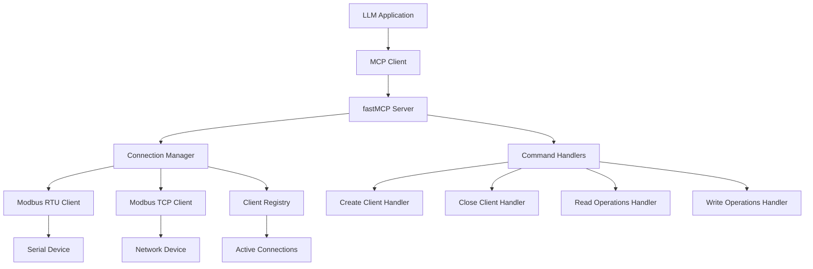

# Design Document: Modbus MCP Server

## Overview

The Modbus MCP Server is a Python application built using fastMCP 2.0 that exposes Modbus client functionality through the Model Context Protocol. The server acts as a bridge between LLM applications and Modbus devices, allowing AI assistants to interact with industrial automation systems, PLCs, sensors, and other Modbus-enabled devices.

The server uses pymodbus as the underlying Modbus library and provides a clean, standardized interface for creating connections and performing read/write operations on coils, discrete inputs, holding registers, and input registers.

## Architecture

### High-Level Architecture



### Component Architecture

The server follows a modular design with clear separation of concerns:

1. **MCP Server Layer**: Built on fastMCP, handles protocol communication
2. **Command Layer**: Processes MCP tool calls and validates parameters
3. **Connection Management Layer**: Manages Modbus client lifecycles
4. **Modbus Client Layer**: Interfaces with pymodbus for actual communication
5. **Validation Layer**: Ensures parameter correctness and error handling

## Components and Interfaces

### 1. MCP Server (FastMCP)

The main server class that handles MCP protocol communication:

```python
from fastmcp import FastMCP

app = FastMCP("modbus-server")

@app.tool()
def list_serial_ports() -> dict:
    """List available serial ports on the system"""
    pass

@app.tool()
def create_rtu_client(port: str, baudrate: int, slave_id: int) -> dict:
    """Create a Modbus RTU client connection"""
    pass

@app.tool()
def create_tcp_client(host: str, port: int = 502, slave_id: int = 1) -> dict:
    """Create a Modbus TCP client connection"""
    pass
```

**Responsibilities:**
- Handle MCP protocol communication
- Route tool calls to appropriate handlers
- Manage server lifecycle and configuration
- Provide tool discovery and documentation

### 2. Connection Manager

Manages the lifecycle of Modbus client connections:

```python
class ConnectionManager:
    def __init__(self):
        self.clients: Dict[str, ModbusClient] = {}
        self.client_info: Dict[str, ClientInfo] = {}
        self.used_ports: Set[str] = set()
    
    def list_serial_ports(self) -> List[SerialPortInfo]:
        """List available serial ports with availability status"""
        pass
    
    def create_rtu_client(self, port: str, baudrate: int, slave_id: int) -> str:
        """Create RTU client and return unique ID"""
        pass
    
    def create_tcp_client(self, host: str, port: int, slave_id: int) -> str:
        """Create TCP client and return unique ID"""
        pass
    
    def close_client(self, client_id: str) -> bool:
        """Close and remove client connection"""
        pass
    
    def get_client(self, client_id: str) -> Optional[ModbusClient]:
        """Retrieve client by ID"""
        pass
```

**Responsibilities:**
- Create and configure Modbus clients
- Assign unique identifiers to connections
- Track active connections and their metadata
- Handle connection cleanup and resource management

### 3. Modbus Client Wrapper

Wraps pymodbus clients with additional functionality:

```python
from pymodbus.client import ModbusTcpClient, ModbusSerialClient

class ModbusClientWrapper:
    def __init__(self, client: Union[ModbusTcpClient, ModbusSerialClient], 
                 client_type: str, slave_id: int):
        self.client = client
        self.client_type = client_type
        self.slave_id = slave_id
        self.connected = False
    
    def connect(self) -> bool:
        """Establish connection to Modbus device"""
        pass
    
    def disconnect(self) -> None:
        """Close connection to Modbus device"""
        pass
    
    def read_coils(self, address: int, count: int) -> List[bool]:
        """Read coil values"""
        pass
    
    def write_coils(self, address: int, values: List[bool]) -> bool:
        """Write coil values"""
        pass
```

**Responsibilities:**
- Wrap pymodbus client functionality
- Handle connection state management
- Provide unified interface for RTU and TCP clients
- Implement error handling and retry logic

### 4. Command Handlers

Individual handlers for each MCP tool:

```python
class ModbusCommandHandlers:
    def __init__(self, connection_manager: ConnectionManager):
        self.connection_manager = connection_manager
    
    def handle_create_rtu_client(self, **kwargs) -> dict:
        """Handle RTU client creation"""
        pass
    
    def handle_read_coils(self, client_id: str, address: int, count: int) -> dict:
        """Handle coil reading operation"""
        pass
```

**Responsibilities:**
- Validate input parameters
- Execute Modbus operations
- Format response data
- Handle operation-specific error cases

### 5. Validation Layer

Provides comprehensive input validation:

```python
class ModbusValidator:
    @staticmethod
    def validate_slave_id(slave_id: int) -> None:
        """Validate slave ID is in valid range (1-247)"""
        pass
    
    @staticmethod
    def validate_address_range(address: int, count: int, max_count: int) -> None:
        """Validate address and count parameters"""
        pass
    
    @staticmethod
    def validate_register_values(values: List[int]) -> None:
        """Validate register values are in 16-bit range"""
        pass
```

**Responsibilities:**
- Validate all input parameters
- Ensure Modbus protocol compliance
- Provide descriptive error messages
- Prevent invalid operations

## Data Models

### Serial Port Information

```python
@dataclass
class SerialPortInfo:
    port: str
    description: str
    available: bool
    in_use_by_client: Optional[str] = None
```

### Client Information

```python
@dataclass
class ClientInfo:
    client_id: str
    client_type: str  # "RTU" or "TCP"
    connection_params: Dict[str, Any]
    slave_id: int
    created_at: datetime
    last_used: datetime
    connected: bool
```

### Operation Results

```python
@dataclass
class ModbusResult:
    success: bool
    data: Optional[List[Union[bool, int]]] = None
    error_message: Optional[str] = None
    error_code: Optional[str] = None
```

### Connection Parameters

```python
@dataclass
class RTUParams:
    port: str
    baudrate: int
    bytesize: int = 8
    parity: str = 'N'
    stopbits: int = 1
    timeout: float = 3.0

@dataclass
class TCPParams:
    host: str
    port: int = 502
    timeout: float = 3.0
```

## Correctness Properties

*A property is a characteristic or behavior that should hold true across all valid executions of a system—essentially, a formal statement about what the system should do. Properties serve as the bridge between human-readable specifications and machine-verifiable correctness guarantees.*

After analyzing the acceptance criteria, several properties can be combined for more comprehensive testing:

### Property 1: Client Creation Uniqueness
*For any* sequence of client creation operations (RTU or TCP), all returned client identifiers should be unique across the entire system.
**Validates: Requirements 1.3, 2.3, 10.5**

### Property 2: Valid Parameter Acceptance
*For any* valid Modbus connection parameters (RTU: valid port/baudrate/slave_id, TCP: valid host/port/slave_id), client creation should succeed and return a valid client identifier.
**Validates: Requirements 1.1, 2.1**

### Property 3: Invalid Parameter Rejection
*For any* invalid connection parameters (invalid ports, out-of-range slave IDs, malformed IP addresses), the system should return descriptive error messages and not create clients.
**Validates: Requirements 1.2, 2.2, 2.4, 1.5**

### Property 4: Client Lifecycle Management
*For any* successfully created client, closing it with its client ID should succeed, remove it from active connections, and prevent further operations on that ID.
**Validates: Requirements 3.1, 3.3, 3.4**

### Property 5: Invalid Client ID Handling
*For any* non-existent or invalid client ID, all operations (close, read, write) should return appropriate error messages.
**Validates: Requirements 3.2**

### Property 6: Read Operation Data Integrity
*For any* valid read operation (coils, discrete inputs, holding registers, input registers), successful operations should return data in the correct format (booleans for bits, integers for registers) and failed operations should return descriptive errors.
**Validates: Requirements 4.2, 4.3, 6.2, 6.3, 7.2, 7.3, 9.2, 9.3**

### Property 7: Write Operation Validation
*For any* write operation (coils, holding registers), the system should validate that the number of values matches the address range and that register values are within 16-bit range (0-65535).
**Validates: Requirements 5.4, 8.4**

### Property 8: Address Range Validation
*For any* Modbus operation, the system should validate address ranges and counts according to Modbus specifications before attempting the operation.
**Validates: Requirements 4.4, 6.4, 7.4, 9.4, 11.4**

### Property 9: Concurrent Client Support
*For any* number of concurrent client connections, the system should maintain separate connection states and allow independent operations on each client.
**Validates: Requirements 10.1, 10.2**

### Property 10: Serial Port Discovery and Availability
*For any* system state, listing serial ports should return accurate availability information, marking ports as unavailable when they are in use by active RTU clients.
**Validates: Requirements 11.1, 11.2, 11.3**

### Property 11: Error Message Consistency
*For any* error condition (validation, communication, timeout, pymodbus exceptions), the system should return descriptive, user-friendly error messages with appropriate error codes.
**Validates: Requirements 12.1, 12.2, 12.3, 12.5**

## Error Handling

### Error Categories

1. **Validation Errors**: Invalid parameters, out-of-range values, malformed inputs
2. **Connection Errors**: Failed to establish connection, network unreachable, serial port unavailable
3. **Communication Errors**: Timeout, device not responding, protocol errors
4. **Operation Errors**: Invalid function codes, device-specific errors, access violations

### Error Response Format

All errors follow a consistent JSON structure:

```python
{
    "success": false,
    "error": {
        "code": "VALIDATION_ERROR",
        "message": "Slave ID must be between 1 and 247",
        "details": {
            "parameter": "slave_id",
            "provided_value": 300,
            "valid_range": "1-247"
        }
    }
}
```

### Error Handling Strategy

1. **Input Validation**: Validate all parameters before attempting operations
2. **Graceful Degradation**: Handle pymodbus exceptions and convert to user-friendly messages
3. **Resource Cleanup**: Ensure connections are properly closed on errors
4. **Logging**: Log all errors for debugging while returning sanitized messages to users
5. **Retry Logic**: Implement configurable retry logic for transient communication errors

## Testing Strategy

### Dual Testing Approach

The testing strategy employs both unit tests and property-based tests to ensure comprehensive coverage:

- **Unit tests**: Verify specific examples, edge cases, and error conditions
- **Property tests**: Verify universal properties across all inputs using randomized testing
- Both approaches are complementary and necessary for comprehensive validation

### Property-Based Testing Configuration

- **Framework**: Use Hypothesis for Python property-based testing
- **Iterations**: Minimum 100 iterations per property test to ensure thorough coverage
- **Test Tagging**: Each property test references its design document property
- **Tag Format**: `# Feature: modbus-mcp-server, Property {number}: {property_text}`

### Unit Testing Focus Areas

Unit tests should concentrate on:
- Specific examples demonstrating correct behavior
- Integration points between fastMCP and pymodbus
- Edge cases like maximum count limits (2000 coils, 125 registers)
- Error conditions and exception handling
- Connection lifecycle management

### Test Environment Setup

- **Mock Modbus Devices**: Use pymodbus server simulator for testing
- **Serial Port Mocking**: Mock serial connections for RTU testing
- **Network Simulation**: Test TCP connections with local test servers
- **Error Injection**: Simulate various failure scenarios

### Coverage Requirements

- **Functional Coverage**: All MCP tools and their parameters
- **Error Coverage**: All error conditions and edge cases
- **Integration Coverage**: fastMCP to pymodbus integration points
- **Concurrency Coverage**: Multiple simultaneous client connections

The testing approach ensures that both individual components work correctly (unit tests) and that the system maintains its correctness properties across all possible inputs (property tests).